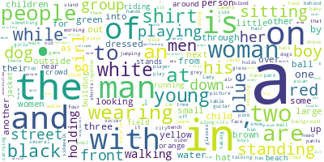
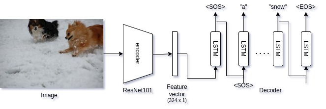
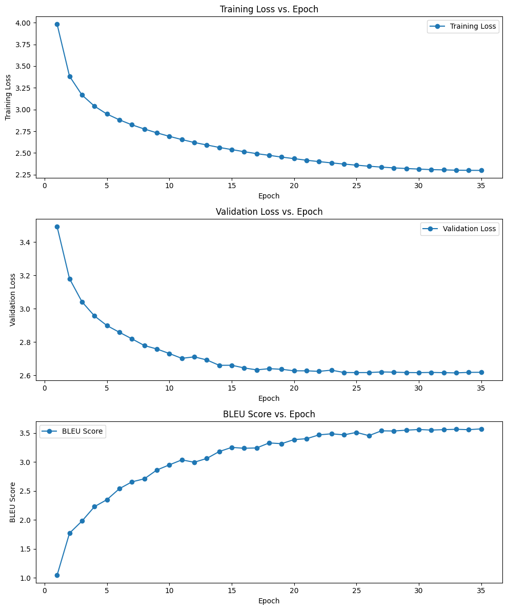

# Caption Mosaic : Pre-Inject Architecture

> "A picture is worth a thousand words, but sometimes we actually want the words."

A Image Captioning Model using PyTorch

<em>Above is the Word Cloud of the whole dataset captions.</em>

## Dataset

It has been trained on flickr 30k dataset.

From: https://www.kaggle.com/datasets/adityajn105/flickr30k

## Architecture

- **Encoder**: Utilizes a pre-trained ResNet101 model(IMAGENET1K_V2) from PyTorch. It is used to extract feature vector from the image. It can be fine-tuned on the dataset images too.
- **Decoder**: Employs an LSTM network to generate caption. With 3 layers and 1x264 hidden size for each captions.

## Training

Trained for 35 epochs, on 24GB GPU for more than 2 hours.

All the code, data augmentation, training and testing has been done here : [Notebook](./notebook/train.ipynb)

<!--  -->

## Results

  
   

- Average BLEU score: **3.56**
- Training Loss: **2.2997**
- Validation Loss: **2.6188**

## TODOs

- Improve the BELU score calculation method by considering all the captions as reference of a particular image.
- Impliment **attention mechanisn** between encoder and decoder for better results.
- Do a hyperparameter-sweep to find the best Hyperparameters.
- Function to directly upload raw image and generate captions.
- Impliment Beam search while generating captions.
